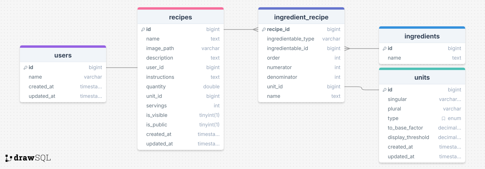

# What is this?
This project contains a python script to query a database of recipes with natural language.

# Recipe Database Schema

# Example Questions and Responses
**Question:** What is the most used ingredient?  
**Answer:** Minced Garlic

**Question:** How many garlic cloves do I need to make Picadillo and the Lemon Garlic Chicken & Rice Skillet?  
**Answer:** To make Picadillo, you need 3 garlic cloves. For the Lemon Garlic Chicken & Rice Skillet, you also need 3 garlic cloves.

**Question:** How many garlic cloves do I need to make Picadillo and the Lemon Garlic Chicken & Rice Skillet?  
**Answer:** To make Picadillo, you need 3 garlic cloves. For the Lemon Garlic Chicken & Rice Skillet, you also need 3 garlic cloves.

**Question:** What is the average number of recipes that each user has added?  
**Answer:** On average, each user has added approximately 1.67 recipes.

**Question:** Were any recipes added on a Sunday? If so, how many?  
**Answer:** No recipes were added on a Sunday.

**Question:** What's the last recipe that Matthew Smith added?  
**Answer:** The last recipe that Matthew Smith added is "Lemon Garlic Chicken & Rice Skillet." It was created on April 15, 2025.

**Question:** Which ingredients have been measured in tablespoons?  
**Answer:** The ingredients measured in tablespoons are Butter, Extra Virgin Olive Oil, and Parsley.

# Question that didn't work
**Question:** What ingredient is most used (in terms of quantity) among all the recipes?  
The units for each ingredient weren't taken into account, just the numerical amount (e.g. it only considered 5 rather than 5 cups).
Though, that might be more of a problem with my database schema than the program itself.

# Prompting Strategies
1. Provide insturctions to each prompt. These are treated as `programmer` inputs which are given greater priority than the normal prompt.
  - Provide the database schema to the instructions of each prompt.
  - Give clear instructions on what to include and not include.
2. Give the context of previous prompts so it knows what to do with the query results. 